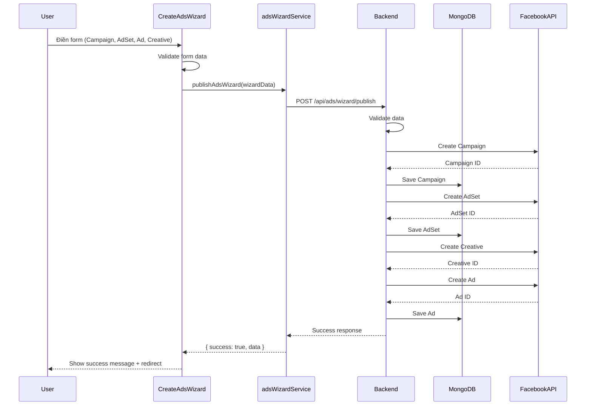
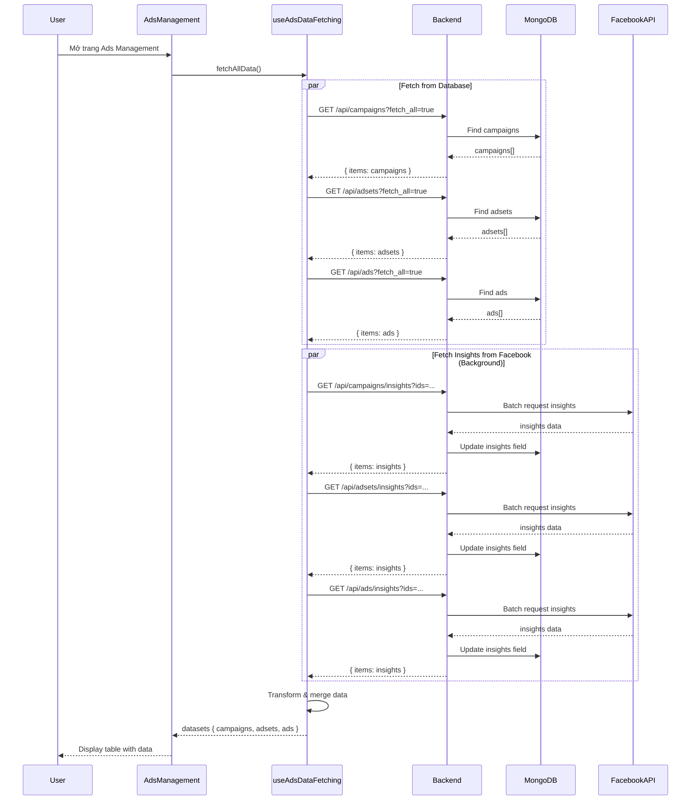
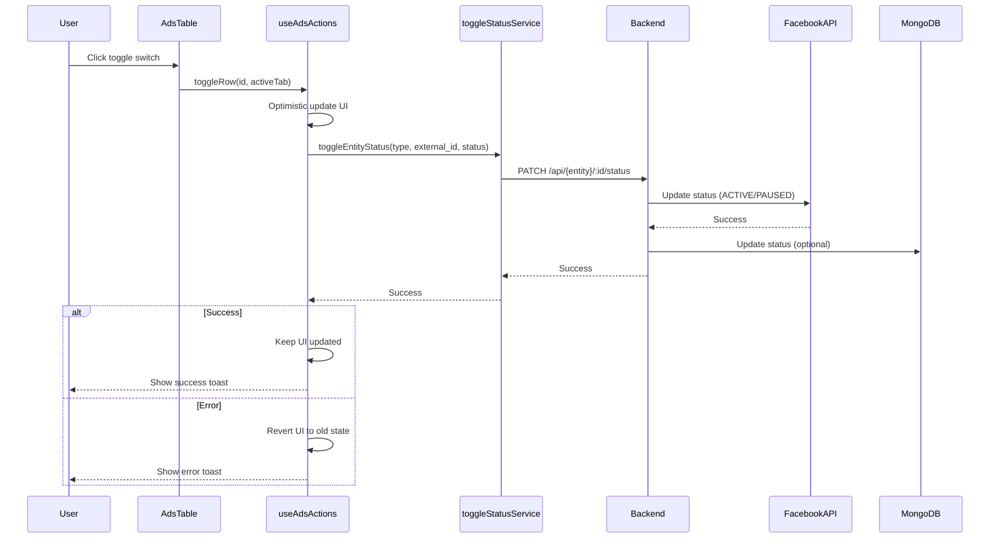
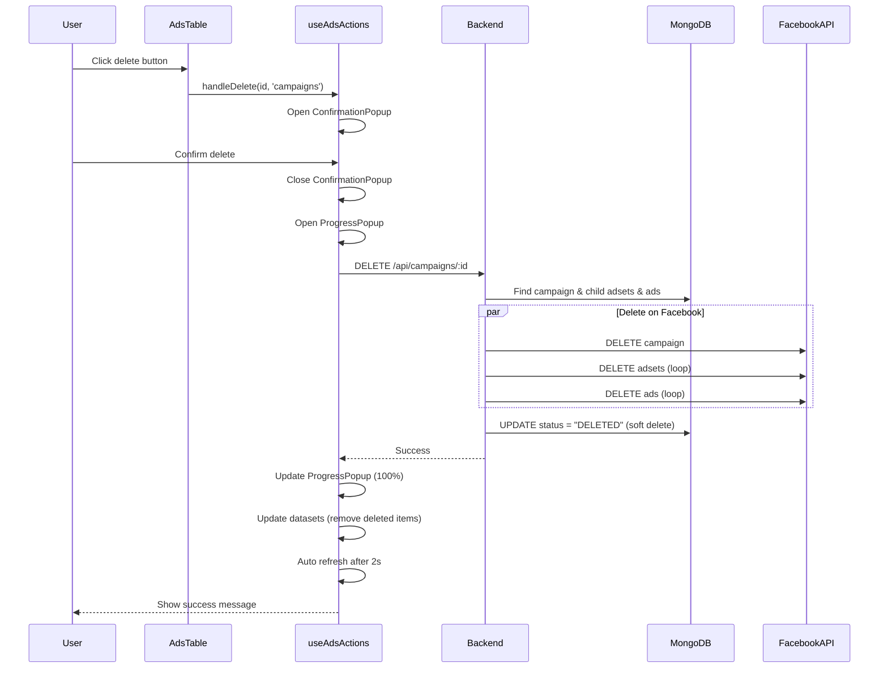
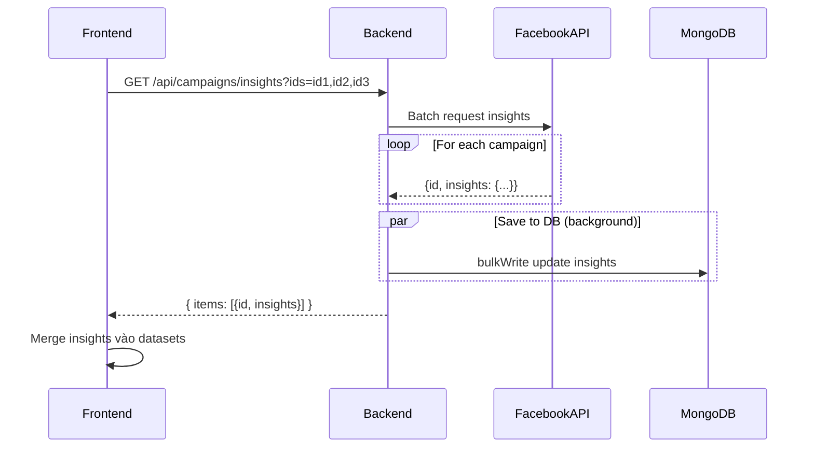

# Auto Ads Management System - CRUD Data Flow Documentation

> **Tài liệu này mô tả chi tiết logic và data flow của hệ thống quản lý quảng cáo (Campaigns, AdSets, Ads)**

## Mục lục

- [1. Tổng quan kiến trúc](#1-tổng-quan-kiến-trúc)
- [2. Các thành phần chính](#2-các-thành-phần-chính)
- [3. CREATE Flow (Tạo quảng cáo)](#3-create-flow-tạo-quảng-cáo)
- [4. READ Flow (Xem quảng cáo)](#4-read-flow-xem-quảng-cáo)
- [5. UPDATE Flow (Cập nhật quảng cáo)](#5-update-flow-cập-nhật-quảng-cáo)
- [6. DELETE Flow (Xóa quảng cáo)](#6-delete-flow-xóa-quảng-cáo)
- [7. Insights & Performance Data](#7-insights--performance-data)
- [8. Database Schema](#8-database-schema)

---

## 1. Tổng quan kiến trúc

Hệ thống quản lý quảng cáo sử dụng kiến trúc **3-tier**:

```
┌──────────────────────────────────────────────────────────┐
│                      FRONTEND (React)                     │
│  - Components (AdsManagement, CreateAdsWizard)           │
│  - Hooks (useAdsActions, useAdsData, useAdsDataFetching) │
│  - Services (adService, adsDataService)                  │
└────────────────────┬─────────────────────────────────────┘
                     │ HTTP/REST API
┌────────────────────▼─────────────────────────────────────┐
│                   BACKEND (Node.js/Express)              │
│  - Routes (adsRoutes, adsCampaignRoutes, adsSetRoutes)  │
│  - Controllers (ads.controller, adsCampaign.controller)  │
│  - Services (fbAdsService, adsWizardService)            │
└────────────────────┬─────────────────────────────────────┘
                     │
           ┌─────────┴──────────┐
           │                    │
    ┌──────▼──────┐      ┌─────▼──────────┐
    │  MongoDB    │      │  Facebook API  │
    │  Database   │      │  Graph API     │
    └─────────────┘      └────────────────┘
```

### Hierarchy của Ads Entities

```
Account (Ads Account)
  └─── Campaign (Chiến dịch)
         └─── AdSet (Nhóm quảng cáo)
                └─── Ad (Quảng cáo)
                       └─── Creative (Nội dung quảng cáo)
```

---

## 2. Các thành phần chính

### 2.1 Frontend Components

#### **Hooks**

| Hook | Chức năng |
|------|-----------|
| `useAdsActions` | Quản lý actions: toggle status, delete, archive |
| `useAdsData` | Quản lý state của datasets (campaigns, adsets, ads) |
| `useAdsDataFetching` | Fetch data từ API và Facebook |
| `useAdsSelection` | Quản lý selection state (checkbox) |
| `useAdsSync` | Đồng bộ dữ liệu với Facebook |

#### **Services**

| Service | Chức năng |
|---------|-----------|
| `adService.js` | API calls cho CRUD operations |
| `adsDataService.js` | Transform và filter data |
| `adsWizardService.js` | Tạo ads qua wizard |
| `toggleStatusService.js` | Bật/tắt status entities |

### 2.2 Backend Components

#### **Controllers**

| Controller | Endpoint Prefix | Chức năng |
|------------|----------------|-----------|
| `ads.controller.js` | `/api/ads` | CRUD cho Ads |
| `adsCampaign.controller.js` | `/api/campaigns` | CRUD cho Campaigns |
| `adsSet.controller.js` | `/api/adsets` | CRUD cho AdSets |
| `adsWizard.controller.js` | `/api/ads/wizard` | Tạo campaign + adset + ad cùng lúc |

#### **Models**

| Model | Collection | Chức năng |
|-------|-----------|-----------|
| `ads.model.js` | `ads` | Schema cho quảng cáo |
| `adsCampaign.model.js` | `adscampaigns` | Schema cho chiến dịch |
| `adsSet.model.js` | `adssets` | Schema cho nhóm quảng cáo |
| `adsAccount.model.js` | `adsaccounts` | Schema cho tài khoản quảng cáo |

---

## 3. CREATE Flow (Tạo quảng cáo)

### 3.1 Tạo qua Create Ads Wizard

**Flow tổng quan:**



**Chi tiết các bước:**

#### Bước 1: User điền form

Người dùng điền thông tin qua các steps:
- **Step 1 - Campaign**: Name, Objective, Budget, Schedule
- **Step 2 - AdSet**: Targeting, Placement, Optimization, Budget
- **Step 3 - Ad**: Format, Creative (Images/Videos, Text, CTA)
- **Step 4 - Review**: Xác nhận thông tin

#### Bước 2: Submit data

```javascript
// File: adsWizardService.js
export const publishAdsWizard = async (wizardData) => {
  const response = await axiosInstance.post('/api/ads/wizard/publish', wizardData)
  return response.data
}
```

#### Bước 3: Backend xử lý

```javascript
// File: adsWizard.controller.js
export async function publishAdsWizard(req, res) {
  // 1. Validate input
  // 2. Create Campaign trên Facebook
  const campaign = await createCampaignOnFacebook(campaignData, accessToken)
  
  // 3. Save Campaign vào MongoDB
  const savedCampaign = await AdsCampaign.create({
    external_id: campaign.id,
    ...campaignData
  })
  
  // 4. Create AdSet trên Facebook
  const adset = await createAdSetOnFacebook(adsetData, campaign.id, accessToken)
  
  // 5. Save AdSet vào MongoDB
  const savedAdset = await AdsSet.create({
    external_id: adset.id,
    campaign_id: savedCampaign._id,
    ...adsetData
  })
  
  // 6. Create Creative + Ad trên Facebook
  const creative = await createCreativeOnFacebook(creativeData, accessToken)
  const ad = await createAdOnFacebook(adData, adset.id, creative.id, accessToken)
  
  // 7. Save Ad vào MongoDB
  const savedAd = await Ads.create({
    external_id: ad.id,
    set_id: savedAdset._id,
    campaign_id: savedCampaign._id,
    creative: creative,
    ...adData
  })
  
  return res.json({ success: true, data: { campaign, adset, ad } })
}
```

### 3.2 Data Model khi tạo

**Campaign Data:**
```javascript
{
  name: string,
  objective: "OUTCOME_LEADS" | "OUTCOME_SALES" | ...,
  status: "PAUSED" | "ACTIVE",
  special_ad_categories: [],
  daily_budget: number (cent),
  lifetime_budget: number (cent),
  start_time: ISO Date,
  stop_time: ISO Date,
  external_account_id: string,
  shop_id: ObjectId,
  account_id: ObjectId
}
```

**AdSet Data:**
```javascript
{
  name: string,
  status: "PAUSED" | "ACTIVE",
  campaign_id: ObjectId,
  optimization_goal: "LEAD_GENERATION" | "OFFSITE_CONVERSIONS" | ...,
  billing_event: "IMPRESSIONS",
  bid_strategy: "LOWEST_COST_WITHOUT_CAP",
  daily_budget: number,
  start_time: ISO Date,
  end_time: ISO Date,
  targeting: {
    age_min: number,
    age_max: number,
    genders: [1,2],
    geo_locations: { countries: ["VN"] },
    ...
  },
  promoted_object: { pixel_id, custom_event_type }
}
```

**Ad Data:**
```javascript
{
  name: string,
  status: "PAUSED" | "ACTIVE",
  set_id: ObjectId,
  campaign_id: ObjectId,
  creative: {
    name: string,
    object_story_spec: {
      page_id: string,
      link_data: {
        link: string,
        message: string,
        name: string,
        description: string,
        call_to_action: { type: "LEARN_MORE", value: { link } },
        image_hash: string (or multi_share_end_card)
      }
    }
  }
}
```

---

## 4. READ Flow (Xem quảng cáo)

### 4.1 List Ads Flow



### 4.2 Data Transformation

**Transform Pipeline:**

```javascript
// File: adsDataService.js

// 1. Transform raw data từ API
const transformedCampaigns = campaigns.map(transformCampaign)
const transformedAdsets = adsets.map(transformAdset)
const transformedAds = ads.map(transformAd)

// 2. Merge insights data
const mergedCampaigns = transformedCampaigns.map(campaign => {
  const insight = insightsData.find(i => i.id === campaign.external_id)
  return insight ? mergeInsights(campaign, insight.insights) : campaign
})

// 3. Filter active items (loại bỏ DELETED, ARCHIVED)
const activeCampaigns = filterActiveItems(mergedCampaigns)

// 4. Sort by created_at DESC
const sortedCampaigns = sortByCreatedAtDesc(activeCampaigns)
```

**Transform Functions:**

```javascript
// Transform Campaign
export const transformCampaign = (campaign) => ({
  id: campaign._id || campaign.id,
  external_id: campaign.external_id,
  name: campaign.name,
  status: campaign.status,
  enabled: campaign.status === "ACTIVE",
  budget: campaign.daily_budget || campaign.lifetime_budget || 0,
  objective: campaign.objective,
  impressions: Number(campaign.insights?.impressions) || 0,
  reach: Number(campaign.insights?.reach) || 0,
  clicks: Number(campaign.insights?.clicks) || 0,
  spend: Number(campaign.insights?.spend) || 0,
  ctr: Number(campaign.insights?.ctr) || 0,
  cpc: Number(campaign.insights?.cpc) || 0,
  cpm: Number(campaign.insights?.cpm) || 0,
  isChecked: false
})
```

### 4.3 API Endpoints cho READ

| Method | Endpoint | Params | Description |
|--------|----------|--------|-------------|
| GET | `/api/campaigns` | `account_id`, `fetch_all`, `status`, `q` | Lấy danh sách campaigns |
| GET | `/api/campaigns/:id` | - | Lấy chi tiết 1 campaign |
| GET | `/api/campaigns/database` | `campaign_id` | Lấy campaign từ DB |
| GET | `/api/campaigns/live` | `account_id`, `access_token` | Lấy campaigns từ Facebook & save DB |
| GET | `/api/campaigns/insights` | `ids` (comma-separated) | Lấy insights từ Facebook & save DB |
| GET | `/api/adsets` | `account_id`, `campaign_id`, `fetch_all` | Lấy danh sách adsets |
| GET | `/api/adsets/live` | `account_id`, `access_token` | Lấy adsets từ Facebook & save DB |
| GET | `/api/adsets/insights` | `ids` | Lấy insights từ Facebook & save DB |
| GET | `/api/ads` | `account_id`, `adset_id`, `fetch_all` | Lấy danh sách ads |
| GET | `/api/ads/live` | `account_id`, `access_token` | Lấy ads từ Facebook & save DB |
| GET | `/api/ads/insights` | `ids` | Lấy insights từ Facebook & save DB |

---

## 5. UPDATE Flow (Cập nhật quảng cáo)

### 5.1 Toggle Status (Bật/Tắt)

**Flow:**



**Code Example:**

```javascript
// File: useAdsActions.js
const toggleRow = useCallback(async (id, activeTab) => {
  const row = datasets[key].find(r => r.id === id)
  const newStatus = !row.enabled
  const facebookStatus = newStatus ? 'ACTIVE' : 'PAUSED'
  
  // 1. Optimistic update
  setDatasets(prev => ({
    ...prev,
    [key]: prev[key].map(r => r.id !== id ? r : {
      ...r,
      enabled: newStatus,
      status: newStatus ? 'Hoạt động' : 'Tạm dừng'
    })
  }))
  
  try {
    // 2. Call API
    await toggleEntityStatus(entityType, row.external_id, facebookStatus)
    toast.success(`${entityType} đã ${newStatus ? 'bật' : 'tắt'}`)
  } catch (error) {
    // 3. Revert on error
    setDatasets(prev => ({
      ...prev,
      [key]: prev[key].map(r => r.id !== id ? r : {
        ...r,
        enabled: !newStatus,
        status: !newStatus ? 'Hoạt động' : 'Tạm dừng'
      })
    }))
    toast.error(`Lỗi ${newStatus ? 'bật' : 'tắt'} ${entityType}`)
  }
}, [datasets, setDatasets, toast])
```

### 5.2 Update Entity Fields

**API Endpoints:**

| Method | Endpoint | Body | Description |
|--------|----------|------|-------------|
| PUT | `/api/campaigns/:id` | `{ name, budget, ... }` | Cập nhật campaign |
| PUT | `/api/adsets/:id` | `{ name, budget, targeting, ... }` | Cập nhật adset |
| PUT | `/api/ads/:id` | `{ name, creative, ... }` | Cập nhật ad |

> **Lưu ý:** Update thường cập nhật cả Facebook API và Database

---

## 6. DELETE Flow (Xóa quảng cáo)

### 6.1 Delete with Cascade

**Flow cho Campaign (cascade delete adsets & ads):**



**Quy trình delete chi tiết:**

#### 1. User trigger delete

```javascript
// File: useAdsActions.js
const handleDelete = useCallback((id, activeTab) => {
  const idsToDelete = id ? [id] : datasets[key].filter(item => item.isChecked).map(item => item.id)
  
  setConfirmationPopup({
    isOpen: true,
    type: 'delete',
    title: `Xóa ${idsToDelete.length} ${entityName}`,
    message: `Bạn có chắc muốn xóa ${idsToDelete.length} ${entityName}?`,
    onConfirm: () => executeDelete(idsToDelete, key, entityName)
  })
}, [datasets])
```

#### 2. Execute delete with progress tracking

```javascript
// File: useAdsActions.js
const executeDelete = useCallback(async (idsToDelete, key, entityName) => {
  // 1. Đóng confirmation, mở progress popup
  setProgressPopup({
    isOpen: true,
    type: 'delete',
    title: `Xóa ${idsToDelete.length} ${entityName}`,
    progress: {
      status: 'loading',
      current: 0,
      total: idsToDelete.length,
      percentage: 0
    }
  })
  
  // 2. Xóa từng item
  for (let i = 0; i < idsToDelete.length; i++) {
    try {
      if (key === 'campaigns') await deleteCampaign(idsToDelete[i], fbToken)
      else if (key === 'adsets') await deleteAdSet(idsToDelete[i], fbToken)
      else await deleteAd(idsToDelete[i], fbToken)
      
      successCount++
    } catch (error) {
      errorCount++
      errors.push({ id: idsToDelete[i], error: error.message })
    }
    
    // 3. Update progress
    setProgressPopup(prev => ({
      ...prev,
      progress: {
        current: i + 1,
        percentage: Math.round(((i + 1) / idsToDelete.length) * 100),
        successCount,
        errorCount
      }
    }))
  }
  
  // 4. Update datasets
  const successIds = idsToDelete.filter(id => !errors.find(e => e.id === id))
  setDatasets(prev => ({
    ...prev,
    [key]: prev[key].filter(item => !successIds.includes(item.id))
  }))
  
  // 5. Auto refresh
  if (onRefresh && successCount > 0) {
    setTimeout(() => onRefresh(), 2000)
  }
}, [setDatasets, toast, onRefresh])
```

#### 3. Backend cascade delete

```javascript
// File: adsCampaign.controller.js
export async function deleteCampaignCascadeCtrl(req, res) {
  const { id } = req.params
  const campaign = await AdsCampaign.findById(id)
  
  // 1. Lấy toàn bộ adsets + ads con
  const adsets = await AdsSet.find({ campaign_id: campaign._id })
  const adsetIds = adsets.map(a => a._id)
  const ads = await Ads.find({ set_id: { $in: adsetIds } })
  
  // 2. Xóa thật trên Facebook (nếu có token)
  if (accessToken) {
    if (campaign.external_id) await deleteEntity(campaign.external_id, accessToken)
    
    for (const adset of adsets) {
      if (adset.external_id) await deleteEntity(adset.external_id, accessToken)
    }
    
    for (const ad of ads) {
      if (ad.external_id) await deleteEntity(ad.external_id, accessToken)
    }
  }
  
  // 3. Soft delete trong DB
  const now = new Date()
  await Promise.all([
    Ads.updateMany({ set_id: { $in: adsetIds } }, { status: "DELETED", deleted_at: now }),
    AdsSet.updateMany({ _id: { $in: adsetIds } }, { status: "DELETED", deleted_at: now }),
    AdsCampaign.findByIdAndUpdate(id, { status: "DELETED", deleted_at: now })
  ])
  
  return res.json({ success: true, message: "Đã xóa campaign và toàn bộ con" })
}
```

### 6.2 Archive vs Delete

| Operation |     Facebook API    |            Database            | Reversible |
|-----------|---------------------|--------------------------------|------------|
|  *Delete* |  Xóa thật (DELETE)  | Soft delete (status = DELETED) |     No     |
| *Archive* |  Xóa thật (DELETE)  |        status = ARCHIVED       |    Yes     |

---

## 7. Insights & Performance Data

### 7.1 Insights Fields

**Performance Metrics:**

```javascript
{
  impressions: number,      // Số lần hiển thị
  reach: number,            // Số người tiếp cận
  clicks: number,           // Số lượt click
  spend: number,            // Chi phí (USD)
  frequency: number,        // Tần suất hiển thị
  ctr: number,              // Click-through rate (%)
  cpc: number,              // Cost per click (USD)
  cpm: number,              // Cost per 1000 impressions (USD)
  results: number,          // Kết quả (leads, conversions...)
  quality: string,          // Quality ranking
  actions: [{              // Chi tiết actions
    action_type: string,
    value: number
  }]
}
```

### 7.2 Insights Sync Flow



**Backend code:**

```javascript
// File: adsCampaign.controller.js
export async function getCampaignInsightsCtrl(req, res) {
  const { ids } = req.query
  const campaignIds = ids.split(',').map(id => id.trim())
  
  // 1. Fetch từ Facebook
  const insightsData = await fetchInsightsForCampaignIds(accessToken, campaignIds)
  
  // 2. Map data
  const items = insightsData.map(item => ({
    id: item.id,
    insights: item.insights || {}
  }))
  
  // 3. Save vào DB (background - không block response)
  if (items.length > 0) {
    const bulkOps = items
      .filter(item => item.insights && Object.keys(item.insights).length > 0)
      .map(item => ({
        updateOne: {
          filter: { external_id: item.id },
          update: { $set: { insights: item.insights, insights_updated_at: new Date() } }
        }
      }))
    
    if (bulkOps.length > 0) {
      AdsCampaign.bulkWrite(bulkOps, { ordered: false })
        .then(() => console.log(`Saved insights for ${bulkOps.length} campaigns`))
        .catch(err => console.error("Error saving insights:", err))
    }
  }
  
  return res.json({ items })
}
```

---

## 8. Database Schema

### 8.1 AdsCampaign Schema

```javascript
{
  _id: ObjectId,
  name: String,
  status: String,                    // "ACTIVE" | "PAUSED" | "DELETED" | "ARCHIVED" | "IN_PROCESS"
  objective: String,                 // "OUTCOME_LEADS", "OUTCOME_SALES", ...
  external_id: String,               // Facebook Campaign ID
  external_account_id: String,       // Facebook Account ID (without act_)
  account_id: ObjectId,              // Reference to AdsAccount._id
  shop_id: ObjectId,                 // Reference to Shop._id
  
  // Budget & Schedule
  daily_budget: Number,              // Cent (VND or USD)
  lifetime_budget: Number,
  start_time: Date,
  stop_time: Date,
  
  // Facebook specific
  effective_status: String,
  special_ad_categories: [String],
  buying_type: String,
  
  // Performance Data
  insights: {
    impressions: Number,
    reach: Number,
    clicks: Number,
    spend: Number,
    ctr: Number,
    cpc: Number,
    cpm: Number,
    frequency: Number,
    actions: [{ action_type: String, value: Number }]
  },
  insights_updated_at: Date,
  
  // Metadata
  created_by: ObjectId,              // Reference to User._id
  created_at: Date,
  updated_at: Date,
  deleted_at: Date
}
```

### 8.2 AdsSet Schema

```javascript
{
  _id: ObjectId,
  name: String,
  status: String,
  external_id: String,
  external_account_id: String,
  campaign_id: ObjectId,             // Reference to AdsCampaign._id
  
  // Budget & Schedule
  daily_budget: Number,
  lifetime_budget: Number,
  start_time: Date,
  end_time: Date,
  
  // Optimization
  optimization_goal: String,         // "LEAD_GENERATION", "OFFSITE_CONVERSIONS", ...
  billing_event: String,             // "IMPRESSIONS"
  bid_strategy: String,              // "LOWEST_COST_WITHOUT_CAP"
  bid_amount: Number,
  
  // Targeting
  targeting: {
    age_min: Number,
    age_max: Number,
    genders: [Number],
    geo_locations: Object,
    interests: [Object],
    behaviors: [Object],
    ...
  },
  
  // Pixel & Conversion
  pixel_id: String,
  conversion_event: String,
  promoted_object: Object,
  
  // Performance Data
  insights: { ... },
  insights_updated_at: Date,
  
  created_by: ObjectId,
  created_at: Date,
  updated_at: Date,
  deleted_at: Date
}
```

### 8.3 Ads Schema

```javascript
{
  _id: ObjectId,
  name: String,
  status: String,
  external_id: String,
  external_account_id: String,
  set_id: ObjectId,                  // Reference to AdsSet._id
  campaign_id: ObjectId,             // Reference to AdsCampaign._id (denormalized)
  
  // Creative
  creative: {
    name: String,
    object_story_spec: {
      page_id: String,
      link_data: {
        link: String,
        message: String,
        name: String,
        description: String,
        call_to_action: {
          type: String,              // "LEARN_MORE", "SIGN_UP", ...
          value: { link: String }
        },
        image_hash: String,          // Single image
        child_attachments: [Object]  // Carousel
      }
    }
  },
  
  // Performance Data
  insights: { ... },
  insights_updated_at: Date,
  
  created_by: ObjectId,
  created_at: Date,
  updated_at: Date,
  deleted_at: Date
}
```

---

## 9. State Management Flow

### 9.1 Frontend State

```javascript
// Main datasets state
const [datasets, setDatasets] = useState({
  campaigns: [],
  adsets: [],
  ads: []
})

// Selection state
const [selectedCampaign, setSelectedCampaign] = useState(null)
const [selectedAdset, setSelectedAdset] = useState(null)

// UI state
const [activeTab, setActiveTab] = useState('campaigns')
const [loading, setLoading] = useState(false)
const [togglingItems, setTogglingItems] = useState(new Set())
```

### 9.2 Data Update Pattern

**Optimistic Update:**

```javascript
// 1. Update UI immediately
setDatasets(prev => ({
  ...prev,
  campaigns: prev.campaigns.map(c => 
    c.id === id ? { ...c, enabled: !c.enabled } : c
  )
}))

// 2. Call API
try {
  await updateAPI()
  toast.success('Success')
} catch (error) {
  // 3. Revert on error
  setDatasets(prev => ({
    ...prev,
    campaigns: prev.campaigns.map(c => 
      c.id === id ? { ...c, enabled: c.enabled } : c
    )
  }))
  toast.error('Error')
}
```

---

## 10. Tổng kết Flow

### CREATE:
1. User điền form → Validate
2. Frontend gọi `POST /api/ads/wizard/publish`
3. Backend tạo Campaign → AdSet → Creative → Ad trên Facebook
4. Backend save vào MongoDB
5. Return success → Frontend redirect

### READ:
1. Frontend gọi `GET /api/campaigns`, `GET /api/adsets`, `GET /api/ads`
2. Backend query MongoDB
3. Frontend gọi `GET /api/.../insights` để lấy performance data từ Facebook
4. Backend merge insights vào DB (background)
5. Frontend transform & display data

### UPDATE:
1. User toggle switch hoặc edit form
2. Frontend optimistic update UI
3. Frontend gọi `PATCH /api/{entity}/:id/status` hoặc `PUT /api/{entity}/:id`
4. Backend update Facebook API
5. Backend update MongoDB
6. Success → giữ UI, Error → revert UI

### DELETE:
1. User click delete → Confirmation popup
2. User confirm → Progress popup
3. Frontend gọi `DELETE /api/{entity}/:id` (có cascade)
4. Backend xóa thật trên Facebook (nếu có token)
5. Backend soft delete trong MongoDB (status = DELETED)
6. Frontend remove khỏi datasets → Auto refresh sau 2s

---

## 11. Best Practices & Notes

### DO:
- Luôn validate data trước khi gửi lên Facebook
- Sử dụng optimistic update cho UX tốt hơn
- Implement progress tracking cho bulk operations
- Soft delete trong DB để có thể recovery
- Cache insights data trong DB để giảm API calls
- Sử dụng batch requests khi fetch insights

### DON'T:
- Không xóa trực tiếp khỏi DB mà dùng soft delete
- Không skip validation ở backend
- Không block UI khi save insights (dùng background job)
- Không fetch insights quá thường xuyên (rate limit)

---

**Document version:** 1.0  
**Last updated:** 2025-12-21  
**Author:** Auto Ads Management System Team
