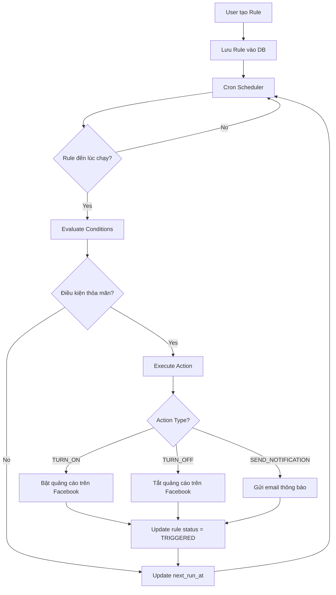
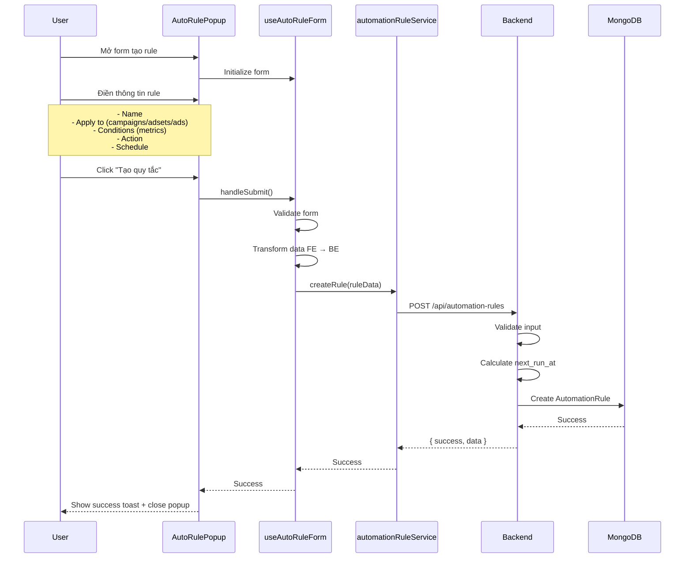
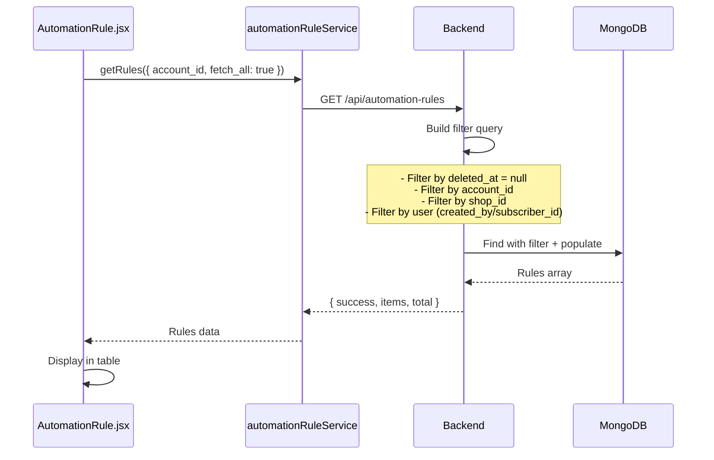
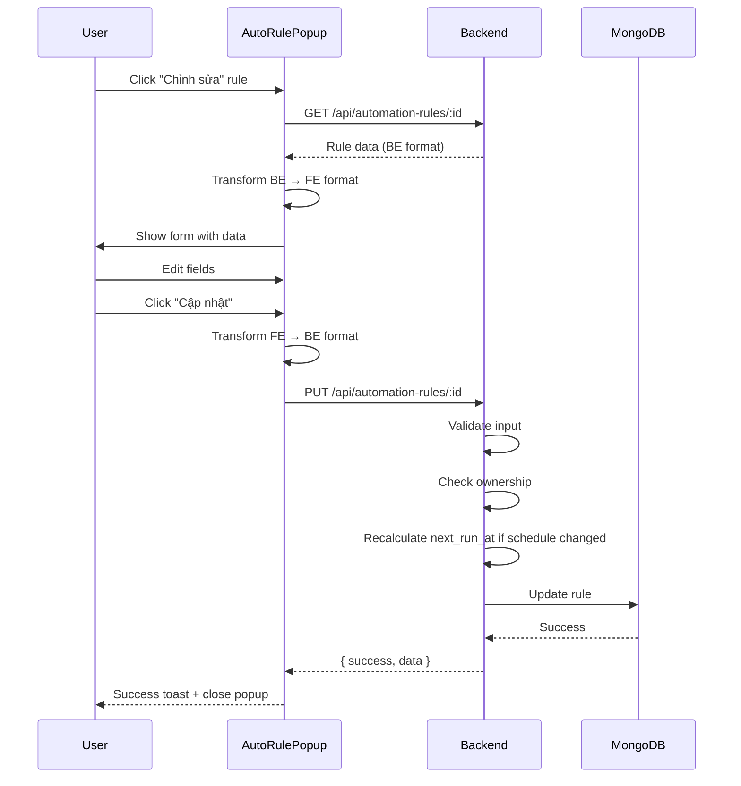
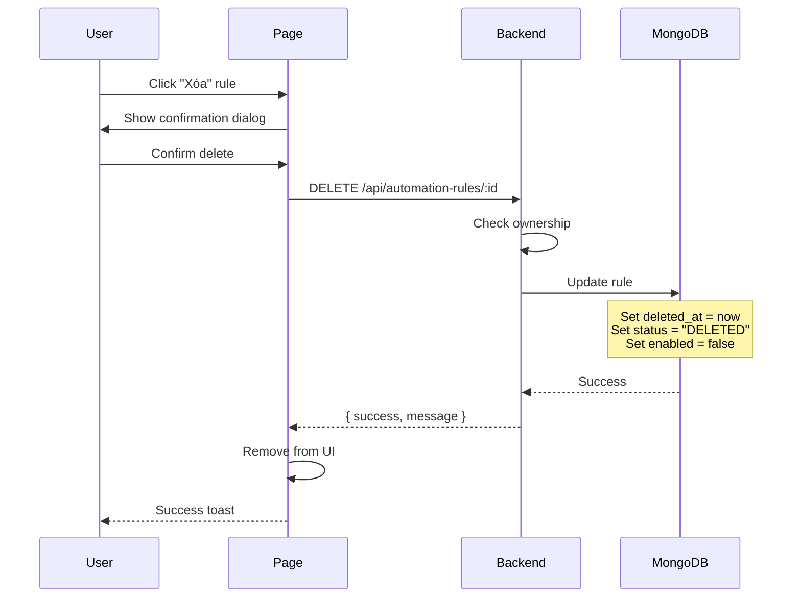
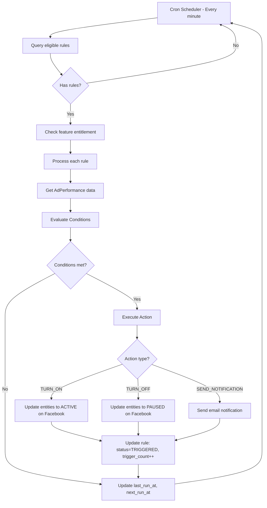
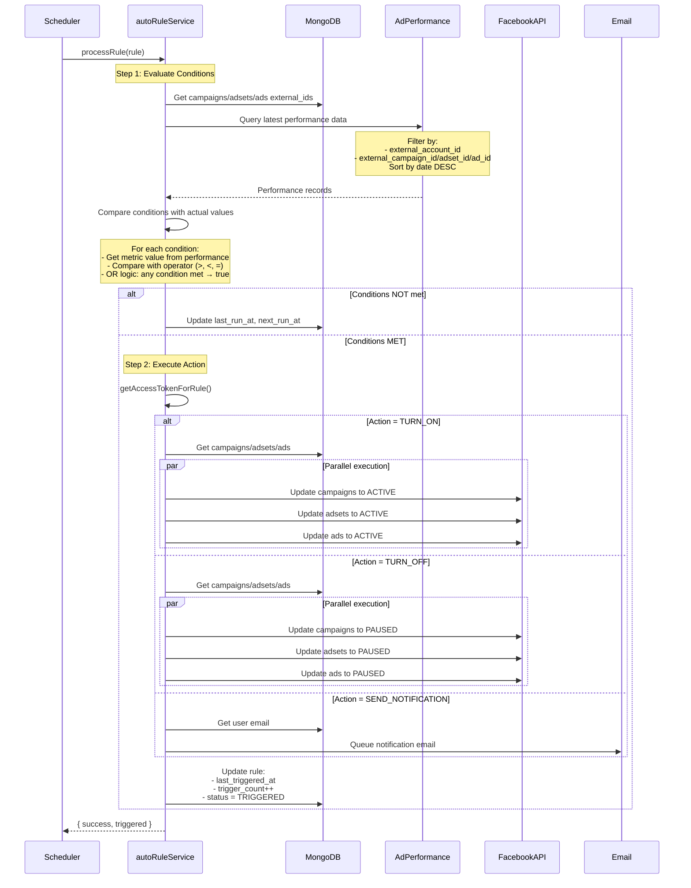
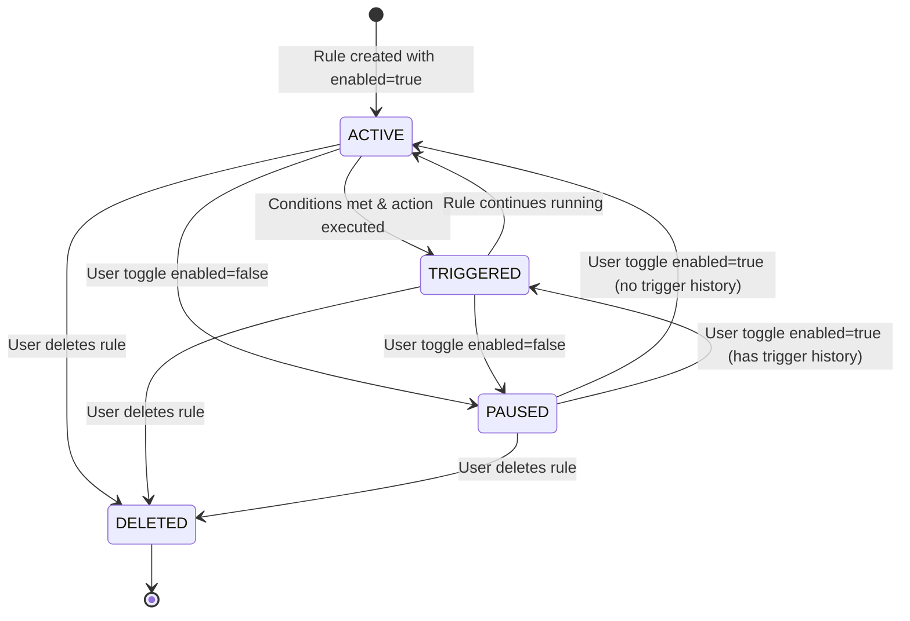
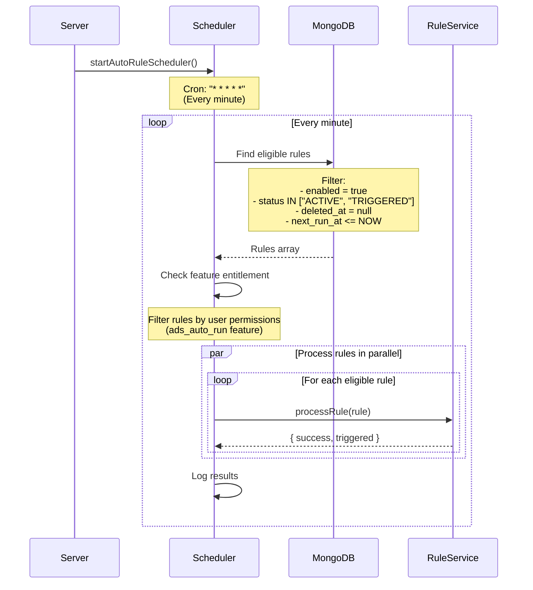

# Auto Ads Management System - Automation Rule Flow Documentation

> **Tài liệu này mô tả chi tiết logic và data flow của hệ thống automation rule (Quy tắc tự động hóa quảng cáo)**

## Mục lục

- [1. Tổng quan Automation Rule](#1-tổng-quan-automation-rule)
- [2. Các thành phần chính](#2-các-thành-phần-chính)
- [3. CREATE Rule Flow](#3-create-rule-flow)
- [4. READ/LIST Rule Flow](#4-readlist-rule-flow)
- [5. UPDATE Rule Flow](#5-update-rule-flow)
- [6. DELETE Rule Flow](#6-delete-rule-flow)
- [7. EXECUTE/TRIGGER Rule Flow](#7-executetrigger-rule-flow)
- [8. Rule Engine Logic](#8-rule-engine-logic)
- [9. Scheduler & Cron Job](#9-scheduler--cron-job)
- [10. Database Schema](#10-database-schema)

---

## 1. Tổng quan Automation Rule

### 1.1 Automation Rule là gì?

Automation Rule là tính năng cho phép người dùng thiết lập các quy tắc tự động để quản lý quảng cáo Facebook dựa trên các điều kiện về performance metrics.

**Ví dụ sử dụng:**
- Tự động tắt chiến dịch khi đã chi tiêu vượt quá ngân sách
- Tự động bật quảng cáo khi CTR đạt trên 5%
- Gửi thông báo khi CPM cao hơn 50,000đ

### 1.2 Kiến trúc tổng quan

```
┌────────────────────────────────────────────────────┐
│              FRONTEND (React)                      │
│  - AutomationRule.jsx (Page)                      │
│  - AutoRulePopup.jsx (Create/Edit Form)           │
│  - useAutoRuleForm.js (Form logic)                │
│  - automationRuleService.js (API calls)           │
└────────────────┬───────────────────────────────────┘
                 │ HTTP/REST API
┌────────────────▼───────────────────────────────────┐
│              BACKEND (Node.js/Express)             │
│  - automationRule.controller.js (CRUD)            │
│  - autoRuleService.js (Rule execution)            │
│  - autoRuleScheduler.js (Cron job)                │
└────────────────┬───────────────────────────────────┘
                 │
      ┌──────────┴──────────┐
      │                     │
┌─────▼──────┐      ┌──────▼───────────┐
│  MongoDB   │      │  Facebook API    │
│  Database  │      │  (Update status) │
└────────────┘      └──────────────────┘
           ▲
           │ Cron Job (Every minute)
    ┌──────┴────────┐
    │  Scheduler    │
    │  Check rules  │
    └───────────────┘
```

### 1.3 Workflow tổng quan



---

## 2. Các thành phần chính

### 2.1 Frontend Components

| Component | Chức năng |
|-----------|-----------|
| `AutomationRule.jsx` | Trang quản lý danh sách automation rules |
| `AutoRulePopup.jsx` | Form tạo/sửa automation rule |
| `useAutoRuleForm.js` | Custom hook quản lý form state và logic |
| `automationRuleService.js` | Service gọi API |
| `autoRuleConstants.js` | Constants và mapping giữa FE/BE |
| `autoRuleValidation.js` | Validation rules cho form |
| `autoRuleUtils.js` | Utility functions |

### 2.2 Backend Components

| Component | Endpoint Prefix | Chức năng |
|-----------|----------------|-----------|
| `automationRule.controller.js` | `/api/automation-rules` | CRUD operations |
| `autoRuleService.js` | - | Rule execution logic |
| `autoRuleScheduler.js` | - | Cron job scheduler |
| `autoRule.model.js` | - | MongoDB schema |

### 2.3 Rule Components

Một rule bao gồm:

```javascript
{
  // Metadata
  name: string,
  enabled: boolean,
  status: "ACTIVE" | "TRIGGERED" | "PAUSED" | "DELETED",
  
  // Apply to (áp dụng cho)
  account_id: ObjectId,
  apply_to: string, // Mô tả: "Các chiến dịch: X, Y, Z"
  apply_to_ids: {
    campaign_ids: [ObjectId],
    adset_ids: [ObjectId],
    ad_ids: [ObjectId]
  },
  
  // Conditions (điều kiện) - OR logic
  conditions: [{
    metric: "spend" | "daily_budget" | "ctr" | ...,
    operator: "GREATER_THAN" | "LESS_THAN" | "EQUAL_TO",
    value: number,
    unit: "CURRENCY" | "PERCENTAGE" | "COUNT" | "FLOAT"
  }],
  
  // Action (hành động)
  action: "TURN_ON" | "TURN_OFF" | "SEND_NOTIFICATION",
  
  // Schedule (lịch trình)
  schedule: {
    type: "CONTINUOUS" | "DAILY" | "CUSTOM",
    daily_time: { start_time, end_time },
    custom_schedule: {
      days: [{
        day: "MONDAY" | "TUESDAY" | ...,
        checked: boolean,
        time_slots: [{ start_time, end_time }]
      }]
    }
  },
  
  // Execution tracking
  last_run_at: Date,
  next_run_at: Date,
  run_count: number,
  last_triggered_at: Date,
  trigger_count: number
}
```

---

## 3. CREATE Rule Flow

### 3.1 Flow Diagram



### 3.2 Data Transformation (FE → BE)

**Frontend data (tiếng Việt user-friendly):**
```javascript
{
  name: "Rule tắt quảng cáo khi chi tiêu cao",
  applyTo: "Các chiến dịch: Campaign A, Campaign B",
  applyToIds: {
    campaignIds: ["65abc...", "65def..."],
    adsetIds: [],
    adIds: []
  },
  conditions: [{
    metric: "Đã chi tiêu",
    operator: "Lớn hơn",
    value: "1000000",
    unit: "đ"
  }],
  action: "Tắt chiến dịch",
  schedule: "continuous",
  notification: true
}
```

**Backend data (English constants):**
```javascript
{
  name: "Rule tắt quảng cáo khi chi tiêu cao",
  apply_to: "Các chiến dịch: Campaign A, Campaign B",
  apply_to_ids: {
    campaign_ids: [ObjectId("65abc..."), ObjectId("65def...")],
    adset_ids: [],
    ad_ids: []
  },
  conditions: [{
    metric: "spend",
    operator: "GREATER_THAN",
    value: 1000000,
    unit: "CURRENCY"
  }],
  action: "TURN_OFF",
  schedule: {
    type: "CONTINUOUS"
  },
  notification: true
}
```

### 3.3 Next Run Calculation

Backend tự động tính `next_run_at` dựa trên `schedule.type`:

#### **CONTINUOUS**: Chạy liên tục mỗi phút
```javascript
next_run_at = new Date(now + 1 minute)
```

#### **DAILY**: Chạy 30 phút/lần trong khung giờ
```javascript
// Example: start_time: "08:00", end_time: "18:00"
// → Chạy lần đầu lúc 08:00, sau đó mỗi 30 phút cho đến 18:00
next_run_at = now + 30 minutes (nếu trong khung giờ)
            = start_time ngày mai (nếu ngoài khung giờ)
```

#### **CUSTOM**: Chạy theo lịch tùy chỉnh
```javascript
// Example: Chạy vào Thứ 2, 4, 6 từ 09:00-12:00 và 14:00-17:00
// → Tìm time slot tiếp theo trong các ngày được chọn
next_run_at = time slot tiếp theo trong lịch
```

---

## 4. READ/LIST Rule Flow

### 4.1 List Rules

**API Endpoint:**
```
GET /api/automation-rules?account_id=act_xxx&fetch_all=true
```

**Flow:**



**Filter Logic:**

```javascript
// Backend filter
const filter = {
  deleted_at: null, // Không lấy rules đã xóa
  external_account_id: { $in: ["123", "act_123"] },
  $or: [
    { created_by: userId },
    { subscriber_id: userId }
  ]
}

// Populate để lấy thông tin liên quan
.populate("account_id", "external_id name")
.populate("created_by", "full_name email")
.populate("subscriber_id", "full_name email")
```

### 4.2 Get Rule Detail

```
GET /api/automation-rules/:id
```

Trả về rule với đầy đủ thông tin đã populate, kiểm tra quyền truy cập.

---

## 5. UPDATE Rule Flow

### 5.1 Flow Diagram



### 5.2 Partial Update Support

Backend hỗ trợ partial update - chỉ cập nhật các field được gửi lên:

```javascript
// Update payload
const updateData = {};

if (name !== undefined) updateData.name = name.trim();
if (enabled !== undefined) updateData.enabled = enabled;
if (conditions !== undefined) updateData.conditions = conditions;
if (schedule !== undefined) {
  updateData.schedule = schedule;
  updateData.next_run_at = calculateNextRunAt(schedule);
}
// ... other fields
```

---

## 6. DELETE Rule Flow

### 6.1 Soft Delete

Rules không bị xóa vĩnh viễn mà chỉ **soft delete** (đánh dấu `deleted_at`).

**Flow:**



**Database change:**

```javascript
// Không xóa record, chỉ update
rule.deleted_at = new Date();
rule.status = "DELETED";
rule.enabled = false;
await rule.save();
```

---

## 7. EXECUTE/TRIGGER Rule Flow

### 7.1 Tổng quan Execution Flow



### 7.2 Chi tiết Process Rule



### 7.3 Condition Evaluation Logic

**Query AdPerformance:**

```javascript
// Build filter với account_id và entity_ids
const filter = {
  external_account_id: { $in: ["123", "act_123"] },
  $or: [
    { external_campaign_id: { $in: ["xxx", "yyy"] } },
    { external_adset_id: { $in: ["aaa", "bbb"] } },
    { external_ad_id: { $in: ["ccc", "ddd"] } }
  ]
};

// Query và sort để lấy bản ghi mới nhất
const records = await AdPerformance.find(filter)
  .sort({ date: -1, created_at: -1 })
  .lean();

const latestRecord = records[0]; // Bản ghi mới nhất
```

**Compare Conditions (OR Logic):**

```javascript
// Nếu KHÔNG có conditions → Luôn thỏa mãn (rule chạy theo lịch)
if (!conditions || conditions.length === 0) {
  return true;
}

// Duyệt qua các conditions
for (const condition of conditions) {
  const actualValue = latestRecord[condition.metric];
  
  const met = compareCondition(condition, actualValue);
  
  if (met) {
    return true; // OR logic: 1 condition thỏa → return true
  }
}

return false; // Không có condition nào thỏa
```

**Comparison Operators:**

```javascript
function compareCondition(condition, actualValue) {
  const { operator, value } = condition;
  
  switch (operator) {
    case "GREATER_THAN":
      return actualValue > value;
    case "LESS_THAN":
      return actualValue < value;
    case "EQUAL_TO":
      return Math.abs(actualValue - value) < 0.01; // Tolerance for float
    default:
      return false;
  }
}
```

### 7.4 Action Execution với Song Song Processing

**Batch Processing với Promise.allSettled:**

```javascript
async function executeTurnOnOff(rule, accessToken, status) {
  const { campaign_ids, adset_ids, ad_ids } = rule.apply_to_ids;
  
  const promises = [];
  
  // Process campaigns
  if (campaign_ids?.length > 0) {
    promises.push(
      AdsCampaign.find({ _id: { $in: campaign_ids } })
        .lean()
        .then(campaigns => 
          processEntitiesInParallel(
            campaigns,
            updateCampaignStatus,
            "Campaign",
            accessToken,
            status,
            concurrencyLimit: 10 // Batch size to avoid rate limit
          )
        )
    );
  }
  
  // Process adsets (parallel với campaigns)
  // Process ads (parallel với campaigns và adsets)
  
  // Chờ tất cả xong
  await Promise.allSettled(promises);
}
```

**Parallel processing với concurrency limit:**

```javascript
async function processEntitiesInParallel(entities, updateFn, type, token, status, limit = 10) {
  const results = { success: 0, failed: 0, errors: [] };
  
  // Chia thành batches (mỗi batch 10 entities)
  const batches = [];
  for (let i = 0; i < entities.length; i += limit) {
    batches.push(entities.slice(i, i + limit));
  }
  
  // Xử lý từng batch tuần tự, trong batch thì song song
  for (const batch of batches) {
    const batchResults = await Promise.allSettled(
      batch.map(entity => updateFn(entity.external_id, token, status))
    );
    
    // Aggregate results
    batchResults.forEach((result, idx) => {
      if (result.status === "fulfilled" && result.value.success) {
        results.success++;
      } else {
        results.failed++;
        results.errors.push(`${type} ${batch[idx].external_id}: ${result.reason}`);
      }
    });
  }
  
  return results;
}
```

---

## 8. Rule Engine Logic

### 8.1 Metrics Mapping

**Available Metrics:**

| Metric (Tiếng Việt) | Backend Field | Unit |
|----------------------|---------------|------|
| Đã chi tiêu | `spend` | Currency (đ) |
| Ngân sách hàng ngày | `daily_budget` | Currency (đ) |
| Tỷ lệ hàng ngày đã chi tiêu | `daily_spend_rate` | Percentage (%) |
| ROAS của lượt mua trên trang web | `website_purchase_roas` | Float |
| CTR (liên kết) | `link_ctr` | Percentage (%) |
| Số lần hiển thị | `impressions` | Count |
| CPC (Liên kết) | `link_cpc` | Currency (đ) |
| Chi phí trên mỗi kết quả | `cost_per_result` | Currency (đ) |
| Kết quả | `results` | Count |
| Tần suất | `frequency` | Float |
| Lượt mua hàng (Meta Pixel) | `website_purchases` | Count |
| Tổng mức chi tiêu | `total_amount_spent` | Currency (đ) |
| Lượt click vào liên kết | `link_clicks` | Count |
| CPM | `cpm` | Currency (đ) |
| % đối tượng tiếp cận được | `audience_reach_percentage` | Percentage (%) |

### 8.2 Schedule Types

#### **CONTINUOUS** - Chạy liên tục

```javascript
// Chạy mỗi phút (thực tế: 1 phút sau lần chạy trước)
{
  type: "CONTINUOUS"
}

// Next run calculation
next_run_at = current_time + 1 minute
```

#### **DAILY** - Chạy hàng ngày trong khung giờ

```javascript
{
  type: "DAILY",
  daily_time: {
    start_time: "08:00", // Bắt đầu lúc 8h sáng
    end_time: "18:00"    // Kết thúc lúc 6h chiều
  }
}

// Chạy mỗi 30 phút từ 08:00 đến 18:00
// Ví dụ: 08:00, 08:30, 09:00, ..., 17:30, 18:00
// Sau 18:00 → next_run_at = 08:00 ngày hôm sau
```

#### **CUSTOM** - Lịch tùy chỉnh

```javascript
{
  type: "CUSTOM",
  custom_schedule: {
    days: [
      {
        day: "MONDAY",
        checked: true,
        time_slots: [
          { start_time: "09:00", end_time: "12:00" },
          { start_time: "14:00", end_time: "17:00" }
        ]
      },
      {
        day: "WEDNESDAY",
        checked: true,
        time_slots: [
          { start_time: "10:00", end_time: "16:00" }
        ]
      },
      {
        day: "FRIDAY",
        checked: false, // Không chạy
        time_slots: []
      }
    ]
  }
}

// Chạy vào Thứ 2: 09:00-12:00 và 14:00-17:00 (mỗi 30 phút)
// Chạy vào Thứ 4: 10:00-16:00 (mỗi 30 phút)
// Không chạy Thứ 6
```

### 8.3 Rule Status Lifecycle



**Status meanings:**

- **ACTIVE**: Rule đang hoạt động, chưa từng trigger
- **TRIGGERED**: Rule đã trigger action ít nhất 1 lần
- **PAUSED**: Rule bị tạm dừng (enabled=false)
- **DELETED**: Rule bị xóa (soft delete)

---

## 9. Scheduler & Cron Job

### 9.1 Scheduler Lifecycle



### 9.2 Scheduler Code

```javascript
// File: autoRuleScheduler.js

import cron from "node-cron";

let schedulerTask = null;

export function startAutoRuleScheduler() {
  // Cron expression: "* * * * *" = every minute
  schedulerTask = cron.schedule("* * * * *", async () => {
    await processScheduledRules();
  });
  
  console.log("✅ AutoRule scheduler started");
}

async function processScheduledRules() {
  const now = new Date();
  
  // Query rules cần chạy
  const rules = await AutomationRule.find({
    enabled: true,
    status: { $in: ["ACTIVE", "TRIGGERED"] },
    deleted_at: null,
    next_run_at: { $lte: now }
  })
  .populate("account_id")
  .populate("created_by")
  .populate("subscriber_id")
  .populate("shop_id");
  
  // Filter by feature entitlement
  const eligibleRules = await filterByEntitlement(rules);
  
  // Process rules song song với Promise.allSettled
  const results = await Promise.allSettled(
    eligibleRules.map(rule => processRule(rule))
  );
  
  // Log kết quả
  logResults(results);
}
```

### 9.3 Feature Entitlement Check

```javascript
// Chỉ user có quyền "ads_auto_run" mới được chạy automation rules
const ownerFeatureMap = new Map();

// Batch check entitlement cho tất cả owners
rules.forEach(rule => {
  const ownerId = resolveRuleOwnerId(rule); // Từ shop_id hoặc created_by
  if (ownerId) ownerFeatureMap.set(ownerId, null);
});

await Promise.all(
  Array.from(ownerFeatureMap.keys()).map(async ownerId => {
    const allowed = await userHasFeature(ownerId, FEATURE_KEYS.ADS_AUTO_RUN);
    ownerFeatureMap.set(ownerId, allowed);
  })
);

// Filter eligible rules
const eligibleRules = rules.filter(rule => {
  const ownerId = resolveRuleOwnerId(rule);
  return ownerFeatureMap.get(ownerId) === true;
});
```

---

## 10. Database Schema

### 10.1 AutomationRule Schema

```javascript
{
  // Liên kết & Ownership
  shop_id: { type: ObjectId, ref: "Shop" },
  account_id: { type: ObjectId, ref: "AdsAccount", required: true },
  external_account_id: { type: String, required: true, index: true },
  created_by: { type: ObjectId, ref: "User", required: true },
  subscriber_id: { type: ObjectId, ref: "User", required: true },
  
  // Thông tin cơ bản
  name: { type: String, required: true },
  enabled: { type: Boolean, default: true },
  status: { 
    type: String, 
    enum: ["ACTIVE", "TRIGGERED", "PAUSED", "DELETED"],
    default: "ACTIVE"
  },
  
  // Apply to
  apply_to: { type: String, required: true }, // Mô tả text
  apply_to_ids: {
    campaign_ids: [{ type: ObjectId, ref: "AdsCampaign" }],
    adset_ids: [{ type: ObjectId, ref: "AdsSet" }],
    ad_ids: [{ type: ObjectId, ref: "Ads" }]
  },
  
  // Action
  action: {
    type: String,
    enum: ["TURN_ON", "TURN_OFF", "SEND_NOTIFICATION"],
    required: true
  },
  
  // Conditions (OR logic)
  conditions: [{
    metric: {
      type: String,
      required: true,
      enum: [
        "spend", "daily_budget", "daily_spend_rate",
        "website_purchase_roas", "link_ctr", "impressions",
        "link_cpc", "cost_per_result", "results",
        "frequency", "website_purchases", "total_amount_spent",
        "link_clicks", "cpm", "audience_reach_percentage"
      ]
    },
    operator: {
      type: String,
      required: true,
      enum: ["GREATER_THAN", "LESS_THAN", "EQUAL_TO"]
    },
    value: { type: Number, required: true },
    unit: {
      type: String,
      enum: ["CURRENCY", "COUNT", "PERCENTAGE", "FLOAT", ""],
      default: "CURRENCY"
    }
  }],
  
  // Schedule
  schedule: {
    type: {
      type: String,
      enum: ["CONTINUOUS", "DAILY", "CUSTOM"],
      required: true,
      default: "CONTINUOUS"
    },
    daily_time: {
      start_time: String, // "HH:MM"
      end_time: String    // "HH:MM"
    },
    custom_schedule: {
      days: [{
        day: {
          type: String,
          enum: ["SUNDAY", "MONDAY", "TUESDAY", "WEDNESDAY", 
                 "THURSDAY", "FRIDAY", "SATURDAY"]
        },
        checked: { type: Boolean, default: false },
        time_slots: [{
          start_time: String, // "HH:MM"
          end_time: String    // "HH:MM"
        }]
      }]
    }
  },
  
  // Notification
  notification: { type: Boolean, default: true },
  
  // Execution tracking
  last_run_at: { type: Date, default: null },
  next_run_at: { type: Date, default: null },
  run_count: { type: Number, default: 0 },
  last_triggered_at: { type: Date, default: null },
  trigger_count: { type: Number, default: 0 },
  last_error: { type: String, default: null },
  last_error_at: { type: Date, default: null },
  
  // Audit & Meta
  meta: { type: Mixed, default: {} },
  updated_by: { type: ObjectId, ref: "User" },
  deleted_at: { type: Date, default: null },
  
  // Timestamps
  created_at: { type: Date },
  updated_at: { type: Date }
}
```

### 10.2 Indexes

```javascript
automationRuleSchema.index({ shop_id: 1 });
automationRuleSchema.index({ account_id: 1 });
automationRuleSchema.index({ created_by: 1 });
automationRuleSchema.index({ subscriber_id: 1 });
automationRuleSchema.index({ enabled: 1, status: 1 });
automationRuleSchema.index({ next_run_at: 1 }); // Quan trọng cho scheduler
automationRuleSchema.index({ "schedule.type": 1, next_run_at: 1 });
automationRuleSchema.index({ deleted_at: 1 });
automationRuleSchema.index({ status: 1, enabled: 1, next_run_at: 1 }); // Composite index cho query scheduler
```

### 10.3 Pre-save Hook

```javascript
// Auto-sync external_account_id từ account_id
automationRuleSchema.pre("save", async function (next) {
  if (this.isModified("account_id") || !this.external_account_id) {
    if (this.account_id) {
      await this.populate("account_id", "external_id");
      if (this.account_id?.external_id) {
        this.external_account_id = this.account_id.external_id;
      }
    }
  }
  next();
});
```

---

## 11. API Endpoints Reference

| Method | Endpoint | Description |
|--------|----------|-------------|
| **GET** | `/api/automation-rules` | Lấy danh sách rules |
| **GET** | `/api/automation-rules/:id` | Lấy chi tiết rule |
| **POST** | `/api/automation-rules` | Tạo rule mới |
| **PUT** | `/api/automation-rules/:id` | Cập nhật rule |
| **DELETE** | `/api/automation-rules/:id` | Xóa rule (soft delete) |
| **PATCH** | `/api/automation-rules/:id/toggle` | Bật/tắt rule |

### Request/Response Examples

#### **CREATE Rule**

```javascript
// POST /api/automation-rules
{
  "name": "Tắt quảng cáo khi chi phí cao",
  "account_id": "65abc123...",
  "shop_id": "65def456...",
  "apply_to": "Chiến dịch: Campaign A",
  "apply_to_ids": {
    "campaign_ids": ["65xxx..."],
    "adset_ids": [],
    "ad_ids": []
  },
  "action": "TURN_OFF",
  "conditions": [{
    "metric": "spend",
    "operator": "GREATER_THAN",
    "value": 1000000,
    "unit": "CURRENCY"
  }],
  "schedule": {
    "type": "CONTINUOUS"
  },
  "notification": true
}

// Response
{
  "success": true,
  "message": "Tạo quy tắc thành công",
  "data": {
    "_id": "65ghi789...",
    "name": "Tắt quảng cáo khi chi phí cao",
    "enabled": true,
    "status": "ACTIVE",
    "next_run_at": "2025-12-21T10:01:00.000Z",
    // ... full rule data
  }
}
```

#### **TOGGLE Rule**

```javascript
// PATCH /api/automation-rules/:id/toggle

// Response
{
  "success": true,
  "message": "Đã bật quy tắc",
  "data": {
    "_id": "65ghi789...",
    "enabled": true,
    "status": "ACTIVE",
    // ... full rule data
  }
}
```

---

## 12. Tổng kết Flow

### CREATE:
1. User điền form → Validate
2. FE transform data (VI → BE format)
3. FE gọi `POST /api/automation-rules`
4. BE validate → Calculate next_run_at
5. BE save vào MongoDB → Return success

### READ:
1. FE gọi `GET /api/automation-rules?account_id=xxx`
2. BE query với filter (account, shop, user)
3. BE populate related data
4. Return danh sách rules

### UPDATE:
1. User edit form → Validate
2. FE transform data → `PUT /api/automation-rules/:id`
3. BE validate → Check ownership
4. BE recalculate next_run_at nếu schedule thay đổi
5. BE update MongoDB → Return success

### DELETE:
1. User click delete → Confirm
2. FE gọi `DELETE /api/automation-rules/:id`
3. BE check ownership → Soft delete (deleted_at, status=DELETED)
4. Return success

### EXECUTE (Scheduler):
1. Cron chạy mỗi phút
2. Query rules với `enabled=true, next_run_at <= now`
3. Check feature entitlement
4. For each rule:
   - Query AdPerformance data (latest record)
   - Evaluate conditions (OR logic)
   - If met → Execute action (TURN_ON/OFF/NOTIFY)
   - Update rule (last_run_at, next_run_at, status, trigger_count)
5. Log results

---

## 13. Best Practices & Notes

### ✅ DO:
- Luôn validate data cả FE và BE
- Sử dụng soft delete cho rules
- Check feature entitlement trước khi execute
- Batch process entities với concurrency limit (tránh rate limit Facebook API)
- Log execution results để debug
- Sử dụng Promise.allSettled để avoid blocking
- Transform data FE ↔ BE để user-friendly

### ⚠️ DON'T:
- Không xóa vĩnh viễn rules (dùng soft delete)
- Không execute rules quá nhanh (mỗi phút là hợp lý)
- Không block scheduler nếu 1 rule lỗi
- Không execute rules của users không có quyền

---

**Document version:** 1.0  
**Last updated:** 2025-12-21  
**Author:** Auto Ads Management System Team
